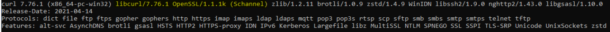
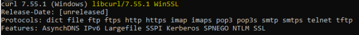

# Onboarding Checklist

## Common Hints

Registration Process: [Process](https://github.com/eu-digital-green-certificates/dgc-overview/blob/main/guides/certificate-governance.md#31-registration-of-national-backends)

## Links to the Environments

- Test Environment: https://test-dgcg-ws.tech.ec.europa.eu
- Acceptance Environment: https://acc-dgcg-ws.tech.ec.europa.eu

## Test Environment

For a successfull connection to the gateway there are several steps to prepare: 

 1) Certificates must be prepared for Test Environment (self signed allowed)
    - Authentication: NB<sub>TLS</sub>
    - Upload:   NB<sub>UP</sub>
    - CSCA(s):  NB<sub>CSCA</sub>
 2) Send the Public Keys in PEM Format to the contact of the Test Operator (functional mailbox)
 3) After Onboarding in the Test Environment, check the connectivity with the following command:<br>
  ```curl -vvv -H "Accept: */*" --resolve ****.ec.europa.eu:443 --cert "auth_de.pem" --key "key.pem" https://****.ec.europa.eu/trustList``` <br>
    You should see a output like: <br>
    
 4) Test the other Truslist Routes in the same style (e.g. with DSC/CSCA/Upload/Authentication...)
 5) Create an Document Signer Certificate and sign it by the CSCA
 6) Create an CMS Package with the following Command: 
  ``` 
      openssl x509 -outform der -in cert.pem -out cert.der
      openssl cms -sign -nodetach -in cert.der -signer signing.crt -inkey signing.key -out signed.der -outform DER -binary
      openssl base64 -in signed.der -out cms.b64 -e -A 
  ``` 
   Note: cert.der is your DSC, signing.crt ist the Uploader Certificate)
  
 7) Upload the CMS Package to the Gateway<br>
    ```curl -v -X POST -H "Content-Type: application/cms" --cert auth_de.pem --key key.pem --data @cms.b64 https://****.ec.europa.eu/signerCertificate``` <br>
 8) Download the Trustlist again, and check if your DSC is available.
 
 
**Note**: Some versions of curl don't attach the client certificates automatically. This can be checked via
``` curl --version ```
Ensure that the used version is linked to OpenSSL. Especially under Windows (https://curl.se/windows/): 
<br><br>
OpenSSL Test Example (working)<br>
<br>

<br><br>
WinSSL Test Example (Not working)
<br><br>



## Acceptance Environment

1) Order/Generate your certificates according the defined requirements in [Certificate Governance](https://github.com/eu-digital-green-certificates/dgc-participating-countries/blob/main/gateway/OnboardingChecklist.md):
    - Authentication: NB<sub>TLS</sub> (TLS [Template](https://github.com/eu-digital-green-certificates/dgc-overview/blob/main/guides/certificate-governance.md#45national-backend-tls-client-authentication-nbtls))
    - Upload:   NB<sub>UP</sub>(Upload [Template](https://github.com/eu-digital-green-certificates/dgc-overview/blob/main/guides/certificate-governance.md#44upload-certificates-nbup))
    - CSCA(s):  NB<sub>CSCA</sub> (CSCA [Template](https://github.com/eu-digital-green-certificates/dgc-overview/blob/main/guides/certificate-governance.md#42csca-certificate-nbcsca))
2) Transfer the certificates via circABC to the Secretariat
3) After the certificate whitelisting, test the functionality again with your backend (E2E)


## Production Environment

1) Push the certificates together with your application for going live over circABC to the secretariat (TBD) 
2) Connect your production setup


    

